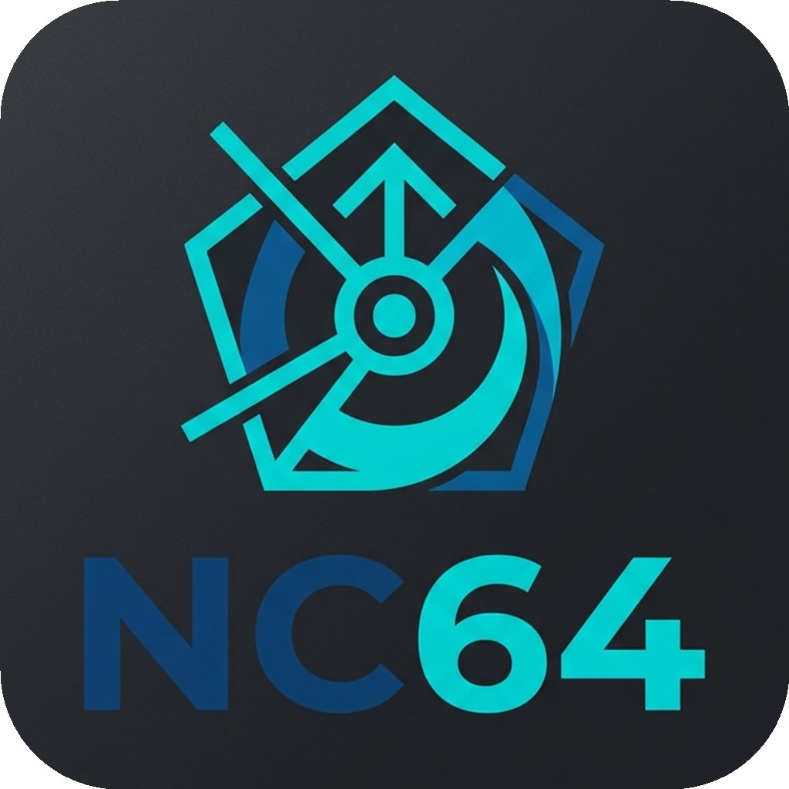

# NC64 IntelliJ IDEA Plugin



A custom syntax highlighting plugin for the **NC64** and **G-Code** programming languages in JetBrains IDEs (IntelliJ IDEA, CLion, PyCharm, etc.).

## Features
* Syntax highlighting for `.nc64` and `.gcode` files
* Custom token parsing for variables, string literals, and comments
* Dedicated highlighting for G-Code commands (`G01`, `G90`), Axes (`X`, `Y`, `Z`), and Local Variables (`_X`, `_Y`)
* Highlight support for function definitions `%moveNomOff()` and function calls
* Customizable colors via standard IDE settings (`Settings > Editor > Color Scheme > NC64`)

## How it Works
The plugin uses a custom Lexer generated by **JFlex** (`nc64.flex`) that tokenizes the G-Code structure based on NC64-specific language rules. The tokens are then processed by the `NC64SyntaxHighlighter` and mapped to customizable JetBrains color scheme attributes.

## Installation from Source

If you want to build and install the plugin manually:

1. **Clone the repository** and open it in IntelliJ IDEA.
2. **Build the plugin**: Run the Gradle `buildPlugin` task.
   ```bash
   ./gradlew.bat buildPlugin
   ```
   This will generate a `.zip` file inside `build/distributions/`.
3. **Install to your IDE**:
   - Open your IDE's Settings/Preferences.
   - Go to **Plugins** > ⚙️ (Gear Icon) > **Install Plugin from Disk...**
   - Select the `.zip` file generated in the `build/distributions/` directory.
   - Restart the IDE.

## Development

To run the plugin inside a temporary Sandbox IDE for development and testing:
```bash
./gradlew.bat runIde
```

### Modifying the Lexer
If you add new keywords or syntax rules, you must edit `src/main/kotlin/.../lexer/nc64.flex`.
After editing the `.flex` file, run:
```bash
./gradlew.bat generateLexer
```
This will automatically regenerate the underlying `_NC64Lexer.java` file used by the parser.
